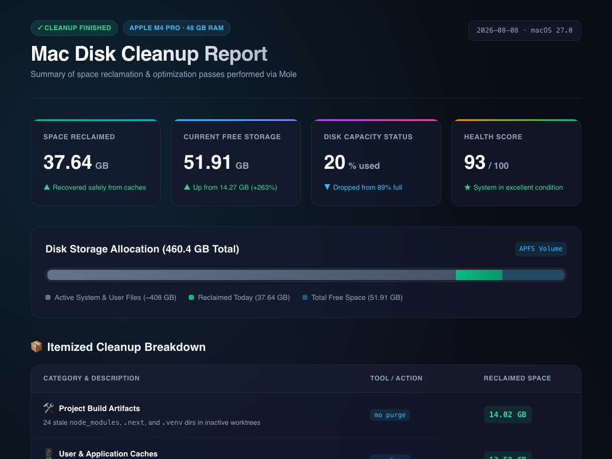
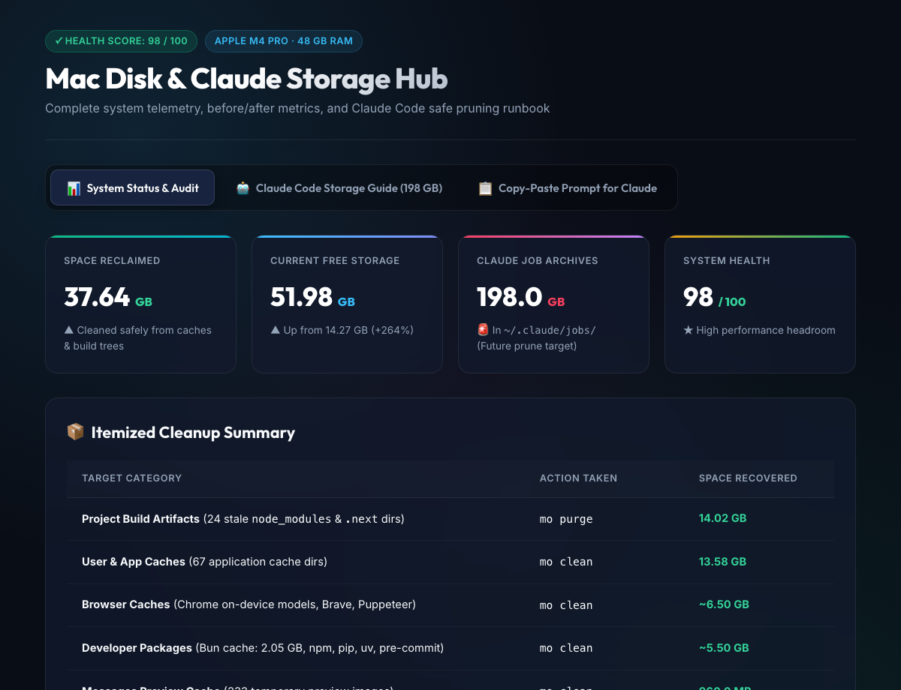

# mac-disk-clean

A runbook that guides an AI coding assistant to clean a Mac safely, using Mole (mo) by tw93.

---

> **Read this before you run it**
>
> This runbook deletes files from your Mac. The AI assistant runs shell commands
> on your machine. Before you start:
>
> - Make a Time Machine backup or another full backup first.
> - Run every phase in dry-run (preview) mode first.
> - Review the list of files the assistant shows you before approving any deletion.
> - Nothing is recoverable after `rm`. There is no undo.
> - You are responsible for what you approve.
> - Use at your own risk.

---

## Why this exists

Commercial Mac cleaners charge subscription fees for basic cache removal. They miss the modern cruft that actually fills developer storage:

- **Agent worktree bloat.** Hundreds of gigabytes archived in `~/.claude/jobs/` or `~/.codex/`.
- **Stale build trees.** Inactive `node_modules`, `.next`, `.venv`, and coverage folders across git worktrees.
- **Package manager stores.** Dangling virtual packages in pnpm, bun, uv, and npm.
- **Browser AI models.** Hidden on-device LLM classifier weights in Chrome and Brave.

This runbook gives your AI assistant (Claude Code, Gemini, ChatGPT, Codex, Antigravity) a safe, step-by-step process to inspect, preview, and clean your Mac. On my own Mac it reclaimed about 50 GB. Your result will differ.

---

## What it protects

The runbook enforces protection rules before any deletion.

| Protected data | Policy |
|---|---|
| iMessage history and attachments | Never touched. `chat.db` and `~/Library/Messages/Attachments` are preserved. Only auto-generated link thumbnails are cleared. |
| iCloud Drive and cloud sync | Never touched. `~/Library/Mobile Documents` and `CloudStorage` are whitelisted. |
| Photos library | Never touched. `~/Pictures` and `*.photoslibrary` are preserved. |
| Agent memories and skills | Never touched. `~/.claude/projects`, `~/.claude/skills`, `~/.gemini/config` are preserved. |

---

## Quick start

### Method 1: Drop into any AI chat

Drag [`SKILL.md`](./SKILL.md) into Claude Code, ChatGPT, Gemini, Codex, or Antigravity, and say:

```text
Please execute this Mac Disk Cleanup runbook on my machine.
```

### Method 2: Install as a Claude Code skill

```bash
mkdir -p ~/.claude/skills/mac-disk-clean
curl -sSL https://raw.githubusercontent.com/dvaladares/mac-disk-clean/main/SKILL.md > ~/.claude/skills/mac-disk-clean/SKILL.md
```

### Method 3: Install for agy / Antigravity

```bash
mkdir -p ~/.gemini/config/skills/mac-disk-clean
curl -sSL https://raw.githubusercontent.com/dvaladares/mac-disk-clean/main/SKILL.md > ~/.gemini/config/skills/mac-disk-clean/SKILL.md
```

---

## What the runbook does

```
1. Tooling baseline    - Checks and installs Mole (mo) via Homebrew, records starting disk state.
2. Phase 1: Caches     - User app caches, browser AI models, service workers (mo clean).
3. Phase 2: Build trees - Inactive node_modules, .next, .venv in git repos (mo purge).
4. Phase 3: Packages   - pnpm store, npm, bun, uv caches, and Docker layers.
5. Phase 4: Agent audit - Scans ~/.claude/jobs/ and large home directories.
6. Phase 5: Dashboard  - Writes a summary report from the cleanup results.
```

---

## Screenshots

<p align="center">
  
</p>

<p align="center">
  
</p>

---

## Credits

This runbook orchestrates [Mole](https://github.com/tw93/mole) by [tw93](https://github.com/tw93) ([mole.fit](https://mole.fit)) and adds guard rails around it. Mole is a fast, native macOS cleaner distributed under the GNU General Public License v3.0 (GPL-3.0).

This project is not affiliated with or endorsed by tw93.

---

## Disclaimer and licence

**No warranty.** This software is provided "as is", without warranty of any kind, express or implied. The author is not liable for data loss, damage, downtime, or any other harm, including if it breaks your Mac.

This runbook is a set of instructions for an AI coding assistant. The assistant interprets and executes the instructions. The assistant can make mistakes. You are responsible for reviewing and approving every action.

This project is not affiliated with Apple, MacPaw, or tw93. CleanMyMac is a trademark of MacPaw Inc. Mention of third-party products is for descriptive purposes only.

**Licence:** [MIT License](./LICENSE), Copyright (c) 2026 Daniel Valadares. The MIT licence covers the runbook text only. Mole has its own GPL-3.0 licence.
